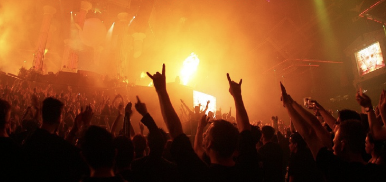

## BeatBlocks
# Blockchain Marketplace for Music Fanatics.

According to a report from Citigroup in 2017 out of the music industry’s $43 billion revenue, only 12% actually went to artists. That’s just a little over $5 billion going to the people who are the foundation of this entire industry! Where does the rest of the money go? 
A good chunk of the revenue is pocketed by the middlemen — those working in the distribution services like radio, online platforms, and record labels. So if you’re an up and coming artist, how do you make it big without signing 

How do you make it big without signing, is in fact the number one question that you ask yourself as an artist. It’s extremely hard to make it as an independent artist, which is why most, if given the chance, are ready to sign 88% of their income away to a record label. I mean, what other option do you have, right?

It’s not like there’s an NFT Marketplace out there that leverages blockchain technology to cut out the middleman, increase your revenue stream, and provide you a ton of exposure and free advertising. I mean there can’t be a disruptive startup out there with a mission to connect artists and fans with unique content and experiences in a way that’s never been done before. Right? 

Actually, there is. Indtroducing BeatBlocks.

# The BeatBlocks VIP experience.

We have created an NFT Marketplace specifically for the music industry. As an artist, you have the ability to mint your song or album as an NFT and sell it on our platform. You can choose the amount of tokens that you want to sell, and also have the ability to sell them in different tiers. For example, let’s say a music producer has a song that he wants to mint and sell different experiences with three token tiers. We call this, the BeatBlocks VIP Experience: 

Lifetime Backstage Passes
Lifetime Front Row Concert Tickets
Lifetime Virtual Concert Tickets
Lifetime Artist Membership - Allows you to hear samples of the songs before they’re released
Remix & Royalties - When a song in the album reaches a set popularity count, a remix version of the song is released, and NFT owners receive lifetime royalties for that song
Artist-to-Artist Access - If you’re an artist yourself, the selling artist will send his team to work with you for a day on one of your songs/projects
Digital Album
Physical Album
New artist merchandise every 6 months.

# Artist portal:
Allows artist to mint token by creating a smart contract.

# Fan portal:
Allows fan to purchase NFT and recieve VIP experience selected. 

# BeatBlocks upcoming 2.0 version.
# Royalties 
Our software engineers and contract managers, are working alongside with artist and fans to onboard the launching of Royalty payment services and music streaming in fall 2021.
We wanted to extend on the perks for the artist as well as the fans purchasing the NFT. 